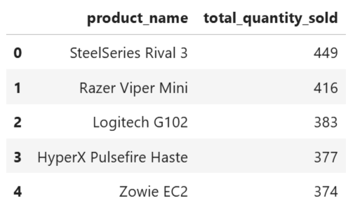
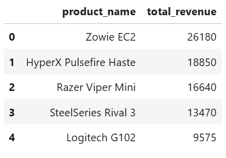
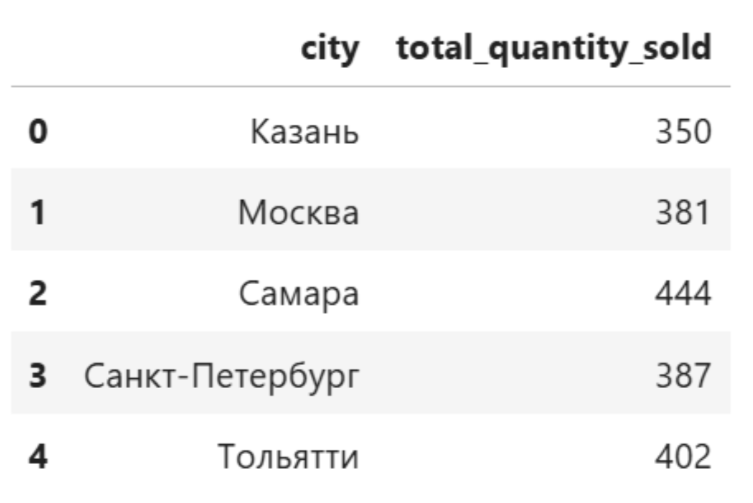
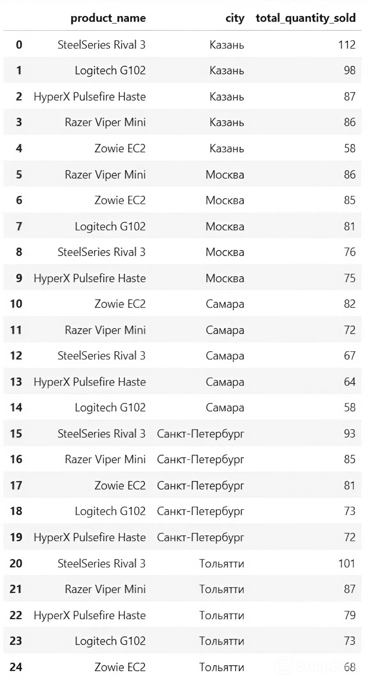
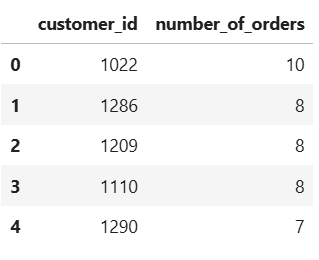
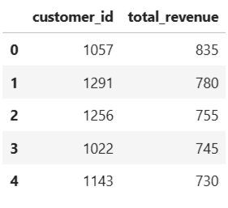
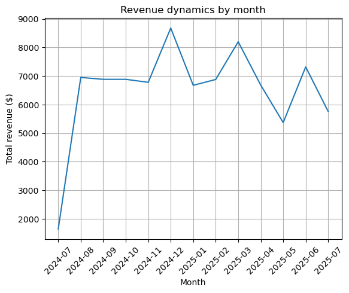

# sales_analytics_for_mouse_shop

## Project Overview

This is an end-to-end business intelligence (BI) and analytics project that simulates a real-world scenario for a fictional online mouse shop. The primary goal is to transform raw and unstructured sales data into actionable business insights. 
The project showcases a complete ELT (Extract, Load, Transform) pipeline, moving from it's initial data generation to a final, shareable business report.

## Technologies Used

*   **Python:** The core language for data generation and orchestration.
*   **Pandas:** For data manipulation and creating initial DataFrames.
*   **SQLite:** As a local, file-based relational database to store and manage the data.
*   **SQL:** The primary language for querying, filtering, joining, and aggregating data.
*   **Matplotlib/Seaborn:** For data visualization and creating insightful charts.
*   **JupyterLab:** Used as the main IDE for analysis.

## Project Structure & Pipeline

This project is structured as a modular ELT pipeline, with each notebook representing a distinct stage:

1.  **`01_data_generation.ipynb`**:
    *   **Purpose:** Creates **synthetic** but **realistic** raw data for products and sales.
    *   **Output:** `products.xlsx` and `sales.xlsx` files.

2.  **`02_create_database.ipynb`**:
    *   **Purpose:** The "Load" stage of the ELT pipeline. Reads the Excel files and loads them into two separate tables (`products` and `sales`) in a local SQLite database (`pasha_mouse_shop.db`).

3.  **`03_business_analysis.ipynb`**:
    *   **Purpose:** The main "Transform" and "Analyze" stage.
    *   Connects to the SQLite database.
    *   Uses SQL queries to answer key business questions.
    *   Visualizes the results to create a final report.

## Key Business Questions & Insights

This analysis aimed to answer several key questions to help the business owner make data-driven decisions.

### 1. What are the most popular vs. the most profitable products?

I discovered that the best-selling product is not the one that generates the most revenue.

*   **Most Popular (by quantity sold):** SteelSeries Rival 3
*   **Most Profitable (by total revenue):** Zowie EC2

**My recommendation:** Focus marketing efforts and ensure stock availability for the Zowie EC2, as it is the main revenue driver. Consider bundling the popular SteelSeries Rival 3 with other items to increase the average check.

### 2. Geographic Sales Analysis

The analysis of sales by city revealed our key markets.

*   **Top Market:** Samara (highest total quantity sold).
*   **Niche Market:** Kazan shows fewer sales but a preference for more expensive products.

**My recommendation:** Double down on what's working in Samara. For Kazan, consider targeted promotions on premium products. For Tolyatti, where the budget-friendly G102 sells the least, a special offer could stimulate the market.

### 3. Who are our VIP Customers?

The analysis identified two different types of "VIP" customers, which require different marketing strategies.

*   **Most Loyal (by number of orders):** Customer ID `1022` is the absolute champion with 10 separate orders. However, this customer ranks only 4th in terms of total revenue, suggesting they prefer budget-friendly products.
*   **Most Profitable (by total revenue):** Customer ID `1057` is our top customer by revenue, bringing in $835, despite making fewer purchases. This customer clearly prefers premium models.

**My recommendation:**
*   For **loyal** customers like #1022, we can offer a "Thank You" discount to encourage repeat purchases.
*   For **profitable** customers like #1057, we should offer exclusive early access to new high-end products to strengthen their VIP status.

### 4. Sales Seasonality

By analyzing revenue dynamics by month, a clear seasonal pattern emerged.

*   A significant sales peak occurs in **December**, likely due to holiday/christmas shopping.

 

**My recommendation:** Prepare for the December peak by increasing inventory in November. Launch targeted holiday marketing campaigns in late October/early November to maximize revenue during this key period.
